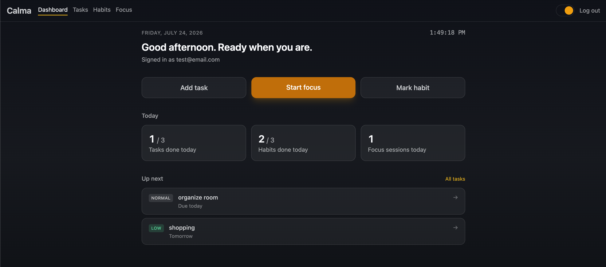
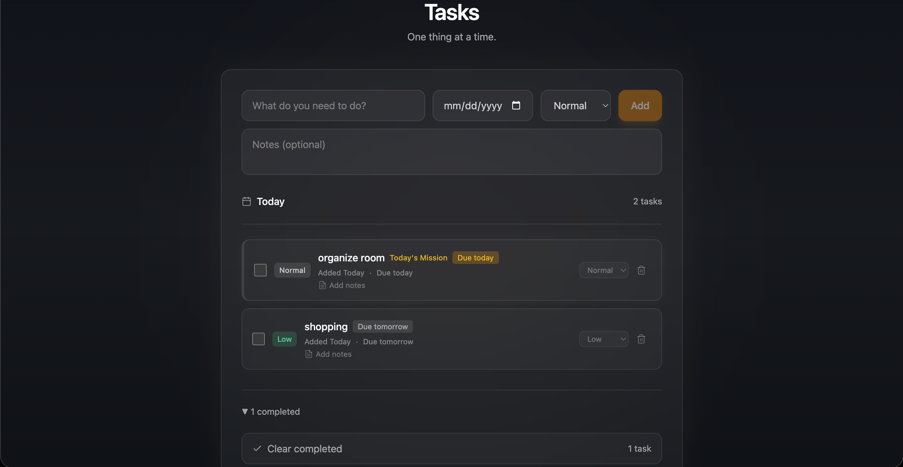
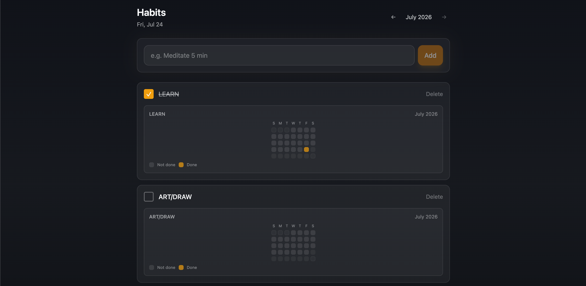
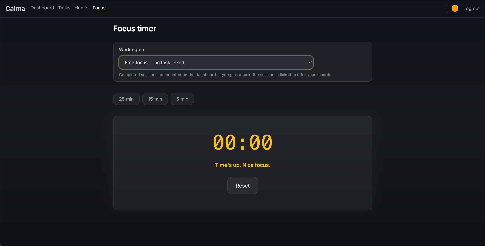
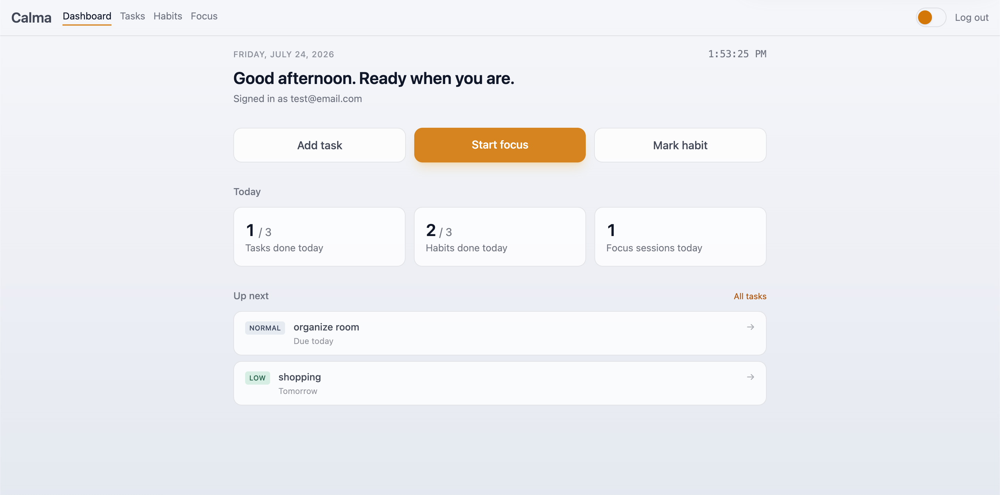

# Calma

**Live demo:** [calma-beta.vercel.app](https://calma-beta.vercel.app)
> Note: the backend is hosted on a free tier and may take up to a minute to wake up on first load.

An ADHD-friendly productivity web app.

## Features

- **Authentication** – Sign up, log in, protected routes
- **Tasks** – Add tasks with priority and due dates, mark complete
- **Habits** – Track daily habits with a visual activity grid
- **Focus timer** – Pomodoro-style timer (25/15/5 min presets) with session tracking
- **Dashboard** – Daily summary of tasks completed, habits done, and focus sessions

## Screenshots

| Dashboard | Tasks |
|---|---|
|  |  |

| Habits | Focus Timer |
|---|---|
|  |  |

| Dashboard lite | 
|---|
|  |

## Tech Stack

- **Frontend:** React + Tailwind CSS (Vite)
- **Backend:** Node.js + Express
- **Database:** MongoDB (Mongoose)

## Getting Started

### Prerequisites

- Node.js 18+
- A MongoDB connection string (free [MongoDB Atlas](https://www.mongodb.com/cloud/atlas) cluster works fine)

### 1. Clone and install

```bash
git clone <your-repo-url>
cd calma

cd server && npm install
cd ../client && npm install
```

### 2. Configure environment variables

Copy the example env files and fill in your own values:

```bash
cp server/.env.example server/.env
cp client/.env.example client/.env
```

- `server/.env` — needs `MONGODB_URI` (your Atlas/local connection string) and `JWT_SECRET` (any long random string, e.g. `openssl rand -base64 48`)
- `client/.env` — `VITE_API_URL` can usually stay as the default (`http://localhost:5001`) for local dev

### 3. Run the app

You need **two terminals** running at the same time:

```bash
# Terminal 1 — API server (http://localhost:5001)
cd server
npm run dev
```

```bash
# Terminal 2 — frontend (http://localhost:5173)
cd client
npm run dev
```

Visit **http://localhost:5173** in your browser.

## Project Structure

```
calma/
├── client/     # React + Vite frontend
└── server/     # Express API + MongoDB models
```

## Status

✅ Deployed and functional. Actively adding features and polish.
